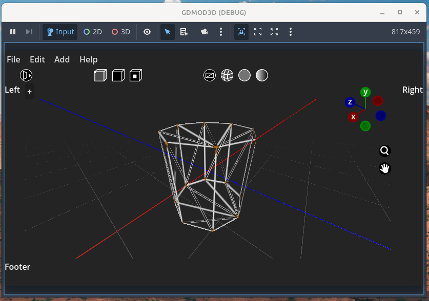

# GDMOD3D

Desktop PC App (Open Source version of DEVMOD3) for 3D modelling (creating and editing 3D meshes).

* Wavefront (.obj) file import and export
* SVG file import to produce a plane mesh

Developed using Godot4.

Controls similar to Blender.

Rectangle select, circle select (ESC - cancel, space to continue selecting).

The goal is to simplify the workflow for designing 3D meshes including UV mapping.

A design decision is to not support incomplete triangles in the mesh. Deleting geometry will result in removal of associated triangles.

Adding geometry will require adding new triangles logically.

## Current status

* In development (the code published here should be in a working state)
* Basic UI functionality including selection of vertices, edges, and faces.
* Camera control for panning, rotation, and zooming.
* Rendering of meshes as solid or wireframe

## Priority To-dos

* Loop select method/algorithm needed.
* Extrude edges/faces capability.

## Requirements to run

* Godot Engine 4.x
* gdUnit4 addon for running unit tests
